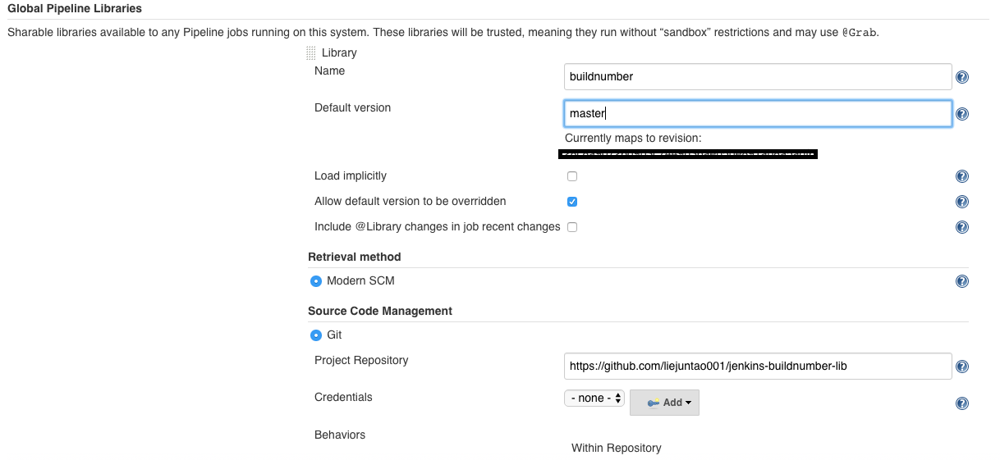
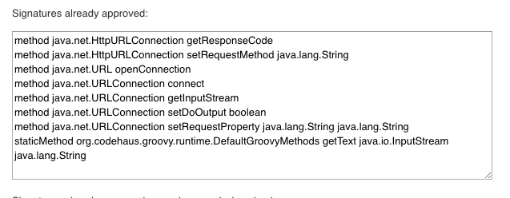
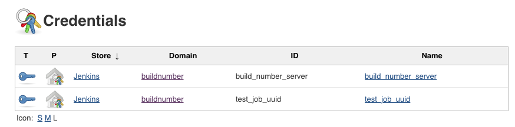
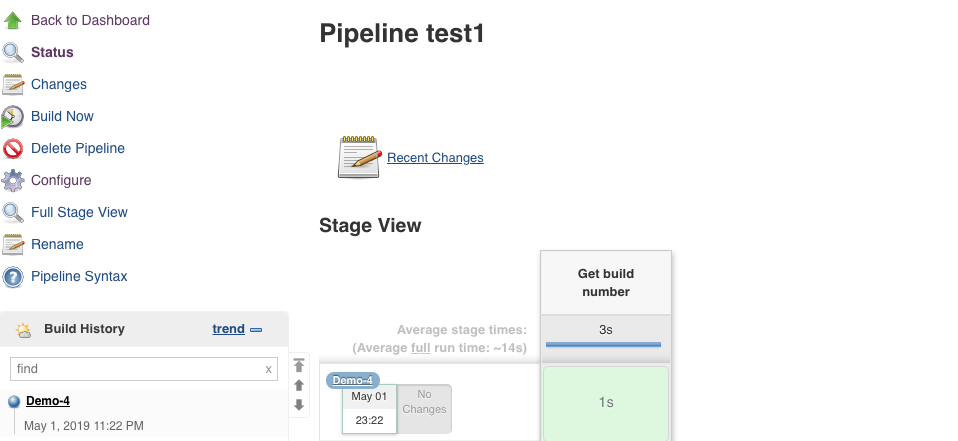
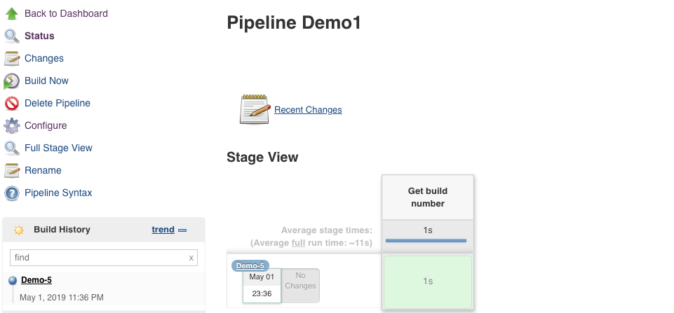

# Jenkins Shared Library to get build number from service

This is a Jenkins Shared Library to retrieve build number from external service.

Normally a Jenkins job uses BUILD_NUMBER in its display-name or as part of the version.

BUILD_NUMBER is just a sequential number, and it's bound to the specific job.

If several jobs are set up for the same project, either due to permission control, or sitting in multiple Jenkins instances, it's nice to retrieve build number from external service to keep consistent version.

Here is [A service to get an incremental number](https://github.com/liejuntao001/buildnumber)

---

## Usage 
### **Recommended** Method 1 - Import into Jenkins 
Import the library following the [instruction](https://jenkins.io/doc/book/pipeline/shared-libraries/)


Use it in pipeline
```
@Library("buildnumber") _
```

### Method 2 - Load dynamically
```
@Library("github.com/liejuntao001/jenkins-buildnumber-lib") _
```
However due to Jenkins security control, multiple methods need get approved.



## Demo

Add Credentials



Below values are for demo purpose ONLY

```
build_number_server = https://buildnumber1.herokuapp.com/
test_job_uuid = e9461f1c-ef78-4162-bcb7-e83da7287614
```

In this demo, 2 pipelines are running same [Demo pipeline](./testjobs/buildnumber_Jenkinsfile.groovy)

pipeline test1 get build_number 4, and pipeline Demo1 get build_number 5.
 


---


